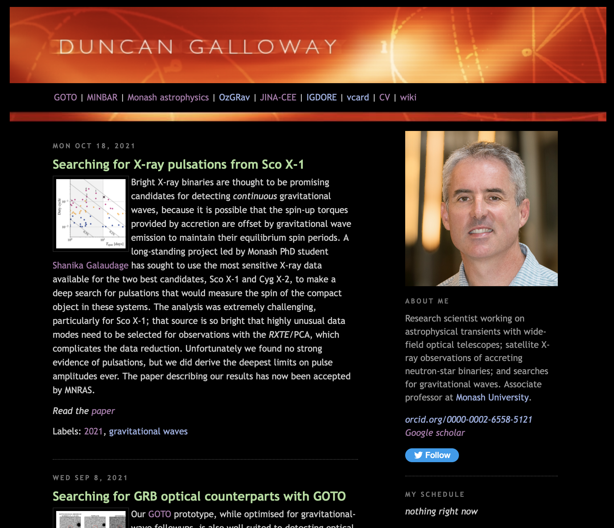

This is my work webpage, which is set up to run in [Jekyll](https://jekyllrb.com), adapted from the earlier site at http://users.monash.edu/~dgallow (which now redirects here), which ran instead on [blosxom](http://blosxom.sourceforge.net)

Most recently implemented are the "archive" features including year &
category pages, and the individual post pages
